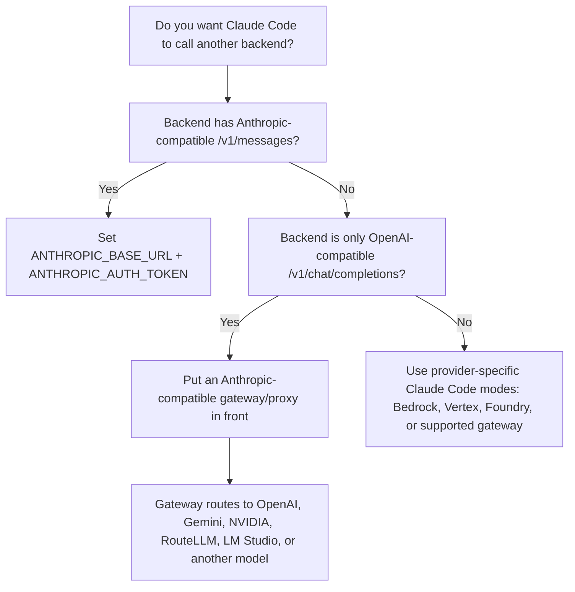
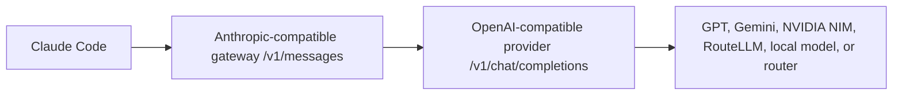

# Replace Claude Code's Backend: LM Studio, OpenRouter, GPT, Gemini, RouteLLM, and NVIDIA

This guide is about routing Claude Code away from Anthropic's default API endpoint.

The critical rule: Claude Code is not a generic OpenAI-compatible client. It sends Claude/Anthropic-style requests unless you use an officially supported provider mode such as Bedrock, Vertex, Foundry, or a gateway. For a custom backend to work cleanly, the backend must expose an API shape Claude Code understands.

Official Claude Code gateway requirement: an LLM gateway must expose at least one supported format, including Anthropic Messages endpoints such as `/v1/messages` and `/v1/messages/count_tokens`, or supported Bedrock/Vertex-compatible endpoints. Source: <https://code.claude.com/docs/en/llm-gateway>

## Decision Tree



## Environment Variables Claude Code Uses for Routing

| Variable | Purpose | Source |
|---|---|---|
| `ANTHROPIC_BASE_URL` | Overrides the API endpoint so requests go through a proxy or gateway. | <https://code.claude.com/docs/en/env-vars> |
| `ANTHROPIC_AUTH_TOKEN` | Sends a custom bearer token through the `Authorization` header. | <https://code.claude.com/docs/en/env-vars> |
| `ANTHROPIC_API_KEY` | Sends an API key as the `X-Api-Key` header and can override subscription auth when set. | <https://code.claude.com/docs/en/env-vars> |
| `ANTHROPIC_MODEL` | Sets the model for the launched session. | <https://code.claude.com/docs/en/model-config> |
| `ANTHROPIC_DEFAULT_SONNET_MODEL`, `ANTHROPIC_DEFAULT_OPUS_MODEL`, `ANTHROPIC_DEFAULT_HAIKU_MODEL` | Pins what Claude Code aliases resolve to. | <https://code.claude.com/docs/en/model-config> |
| `ANTHROPIC_CUSTOM_MODEL_OPTION` | Adds a custom model entry to `/model`. | <https://code.claude.com/docs/en/model-config> |
| `CLAUDE_CODE_ENABLE_GATEWAY_MODEL_DISCOVERY` | Lets Claude Code query a gateway `/v1/models` endpoint for model picker entries when supported. | <https://code.claude.com/docs/en/llm-gateway> |

## Path 1: Replace Claude Code with LM Studio Local Models

LM Studio documents Claude Code support through an Anthropic-compatible `POST /v1/messages` endpoint. Source: <https://lmstudio.ai/docs/integrations/claude-code>

### 1. Start LM Studio's Server

In LM Studio, load a model and start the local server, or use the CLI:

```bash
lms server start --port 1234
```

Expected result: LM Studio listens on `http://localhost:1234`.

### 2. Verify the Anthropic-Compatible Endpoint Exists

```bash
curl http://localhost:1234/v1/models
```

If your LM Studio version exposes model listing differently, use the model identifier shown in the LM Studio UI. LM Studio documents Anthropic-compatible `/v1/messages` and OpenAI-compatible `/v1/*` endpoints separately. Sources: <https://lmstudio.ai/docs/developer/anthropic-compat> and <https://lmstudio.ai/docs/developer/openai-compat>

### 3. Point Claude Code at LM Studio

macOS/Linux/WSL:

```bash
export ANTHROPIC_BASE_URL="http://localhost:1234"
export ANTHROPIC_AUTH_TOKEN="lmstudio"
export ANTHROPIC_API_KEY=""
claude --model openai/gpt-oss-20b
```

Windows PowerShell:

```powershell
$env:ANTHROPIC_BASE_URL="http://localhost:1234"
$env:ANTHROPIC_AUTH_TOKEN="lmstudio"
$env:ANTHROPIC_API_KEY=""
claude --model openai/gpt-oss-20b
```

Replace `openai/gpt-oss-20b` with the exact model ID LM Studio exposes. LM Studio's docs recommend using a model and context configuration above roughly 25k context because coding tools can consume a lot of context. Source: <https://lmstudio.ai/docs/integrations/claude-code>

### 4. If LM Studio Authentication Is Enabled

macOS/Linux/WSL:

```bash
export LM_API_TOKEN="your_lm_studio_token_here"
export ANTHROPIC_BASE_URL="http://localhost:1234"
export ANTHROPIC_AUTH_TOKEN="$LM_API_TOKEN"
export ANTHROPIC_API_KEY=""
claude --model your_lm_studio_model_id_here
```

Windows PowerShell:

```powershell
$env:LM_API_TOKEN="your_lm_studio_token_here"
$env:ANTHROPIC_BASE_URL="http://localhost:1234"
$env:ANTHROPIC_AUTH_TOKEN=$env:LM_API_TOKEN
$env:ANTHROPIC_API_KEY=""
claude --model your_lm_studio_model_id_here
```

LM Studio says that when Require Authentication is enabled, it accepts `x-api-key` and `Authorization: Bearer <token>` headers. Source: <https://lmstudio.ai/docs/developer/anthropic-compat>

### 5. Verify Inside Claude Code

Inside Claude Code:

```txt
/status
/model
```

Expected result: `/status` should show the custom base URL, and `/model` or the startup model should reflect the model you selected.

## Path 2: Use OpenRouter Directly

OpenRouter documents a Claude Code integration using its Anthropic-compatible surface at `https://openrouter.ai/api`. It also warns that Claude Code with OpenRouter is only guaranteed to work with the Anthropic first-party provider. Source: <https://openrouter.ai/docs/cookbook/coding-agents/claude-code-integration>

macOS/Linux/WSL:

```bash
export OPENROUTER_API_KEY="your_openrouter_api_key_here"
export ANTHROPIC_BASE_URL="https://openrouter.ai/api"
export ANTHROPIC_AUTH_TOKEN="$OPENROUTER_API_KEY"
export ANTHROPIC_API_KEY=""
claude
```

Windows PowerShell:

```powershell
$env:OPENROUTER_API_KEY="your_openrouter_api_key_here"
$env:ANTHROPIC_BASE_URL="https://openrouter.ai/api"
$env:ANTHROPIC_AUTH_TOKEN=$env:OPENROUTER_API_KEY
$env:ANTHROPIC_API_KEY=""
claude
```

If you were previously logged in with Anthropic OAuth, run this inside Claude Code once:

```txt
/logout
```

Then restart `claude`.

Verify:

```txt
/status
```

Expected result: `/status` should show `ANTHROPIC_AUTH_TOKEN` and `https://openrouter.ai/api`. Source: <https://openrouter.ai/docs/cookbook/coding-agents/claude-code-integration>

## Path 3: Use GPT, Gemini, NVIDIA NIM, RouteLLM, or Other OpenAI-Compatible APIs

Most non-Anthropic providers expose an OpenAI-compatible endpoint such as `/v1/chat/completions`. Claude Code cannot use those endpoints directly unless the provider also exposes an Anthropic-compatible endpoint or you add a gateway that translates Claude Code's Anthropic Messages requests into the upstream provider format.

Examples of OpenAI-compatible providers:

| Provider | Native compatible surface | Direct Claude Code? | Source |
|---|---|---|---|
| OpenAI/GPT | `https://api.openai.com/v1/chat/completions` | No, use an Anthropic-compatible gateway. | <https://platform.openai.com/docs/api-reference/chat/create-chat-completion> |
| Gemini API | OpenAI-compatible endpoint at `https://generativelanguage.googleapis.com/v1beta/openai/` | No, use an Anthropic-compatible gateway unless your router exposes Anthropic format. | <https://ai.google.dev/gemini-api/docs/openai> |
| NVIDIA NIM | OpenAI-compatible `/v1/chat/completions` and `/v1/models` | No, use an Anthropic-compatible gateway. | <https://docs.nvidia.com/nim/large-language-models/1.12.0/api-reference.html> |
| RouteLLM / Abacus RouteLLM | OpenAI-compatible base URLs such as `https://routellm.abacus.ai/v1` | No, use an Anthropic-compatible gateway. | <https://abacus.ai/help/developer-platform/route-llm> |
| rout.my | Provides OpenAI-compatible and Anthropic-compatible base URLs. | Yes if you use its Anthropic-compatible surface and exact model IDs. | <https://docs.rout.my/> |
| LM Studio OpenAI mode | `http://localhost:1234/v1/chat/completions` | Prefer LM Studio's Anthropic-compatible Claude Code path instead. | <https://lmstudio.ai/docs/developer/openai-compat> |

## Generic Gateway Pattern

Use this when the upstream provider is OpenAI-compatible only:



### 1. Deploy or Start a Gateway

Your gateway must expose Anthropic Messages-compatible endpoints to Claude Code. Claude Code's official gateway docs list LiteLLM as one possible third-party gateway pattern and warn to avoid compromised LiteLLM PyPI versions `1.82.7` and `1.82.8`. Source: <https://code.claude.com/docs/en/llm-gateway>

Example target:

```txt
http://localhost:4000/v1/messages
```

### 2. Configure the Gateway Upstream

Use the upstream provider's base URL and model ID in the gateway config, not directly in Claude Code:

```yaml
model_list:
  - model_name: gpt-router
    litellm_params:
      model: openai/your_gpt_model_here
      api_key: your_openai_api_key_here

  - model_name: gemini-router
    litellm_params:
      model: gemini/your_gemini_model_here
      api_key: your_gemini_api_key_here

  - model_name: nvidia-router
    litellm_params:
      model: openai/your_nvidia_model_here
      api_base: https://integrate.api.nvidia.com/v1
      api_key: your_nvidia_api_key_here
```

This file is an example shape only. Check your chosen gateway's current documentation before using exact keys.

### 3. Point Claude Code at the Gateway

macOS/Linux/WSL:

```bash
export ANTHROPIC_BASE_URL="http://localhost:4000"
export ANTHROPIC_AUTH_TOKEN="your_gateway_token_here"
export ANTHROPIC_API_KEY=""
export ANTHROPIC_MODEL="gpt-router"
claude
```

Windows PowerShell:

```powershell
$env:ANTHROPIC_BASE_URL="http://localhost:4000"
$env:ANTHROPIC_AUTH_TOKEN="your_gateway_token_here"
$env:ANTHROPIC_API_KEY=""
$env:ANTHROPIC_MODEL="gpt-router"
claude
```

### 4. Optional: Add a Custom Model to `/model`

macOS/Linux/WSL:

```bash
export ANTHROPIC_CUSTOM_MODEL_OPTION="gpt-router"
export ANTHROPIC_CUSTOM_MODEL_OPTION_NAME="GPT via Gateway"
export ANTHROPIC_CUSTOM_MODEL_OPTION_DESCRIPTION="Gateway-routed OpenAI-compatible upstream"
claude
```

Windows PowerShell:

```powershell
$env:ANTHROPIC_CUSTOM_MODEL_OPTION="gpt-router"
$env:ANTHROPIC_CUSTOM_MODEL_OPTION_NAME="GPT via Gateway"
$env:ANTHROPIC_CUSTOM_MODEL_OPTION_DESCRIPTION="Gateway-routed OpenAI-compatible upstream"
claude
```

Claude Code documents `ANTHROPIC_CUSTOM_MODEL_OPTION` for custom picker entries and `CLAUDE_CODE_ENABLE_GATEWAY_MODEL_DISCOVERY=1` for supported gateway model discovery. Sources: <https://code.claude.com/docs/en/model-config> and <https://code.claude.com/docs/en/llm-gateway>

### 5. Verify Routing

```txt
/status
/model
```

Then check the gateway logs. The request path should hit your gateway first, then the upstream provider.

## Provider Recipes

### GPT / OpenAI Through a Gateway

Use OpenAI's normal API key and model name in the gateway. OpenAI documents Chat Completions at `https://api.openai.com/v1/chat/completions`. Source: <https://platform.openai.com/docs/api-reference/chat/create-chat-completion>

Claude Code side:

```bash
export ANTHROPIC_BASE_URL="http://localhost:4000"
export ANTHROPIC_AUTH_TOKEN="your_gateway_token_here"
export ANTHROPIC_API_KEY=""
export ANTHROPIC_MODEL="gpt-router"
claude
```

### Gemini Through a Gateway

Google documents OpenAI compatibility with this base URL:

```txt
https://generativelanguage.googleapis.com/v1beta/openai/
```

Source: <https://ai.google.dev/gemini-api/docs/openai>

Claude Code side:

```bash
export ANTHROPIC_BASE_URL="http://localhost:4000"
export ANTHROPIC_AUTH_TOKEN="your_gateway_token_here"
export ANTHROPIC_API_KEY=""
export ANTHROPIC_MODEL="gemini-router"
claude
```

### NVIDIA NIM Through a Gateway

NVIDIA documents OpenAI-compatible NIM LLM endpoints including `/v1/models`, `/v1/chat/completions`, and `/v1/completions`. Source: <https://docs.nvidia.com/nim/large-language-models/1.12.0/api-reference.html>

Claude Code side:

```bash
export ANTHROPIC_BASE_URL="http://localhost:4000"
export ANTHROPIC_AUTH_TOKEN="your_gateway_token_here"
export ANTHROPIC_API_KEY=""
export ANTHROPIC_MODEL="nvidia-router"
claude
```

### RouteLLM / Router Providers Through a Gateway

Abacus RouteLLM documents an OpenAI-compatible routing API and a `route-llm` routing model. Source: <https://abacus.ai/help/developer-platform/route-llm>

Claude Code side:

```bash
export ANTHROPIC_BASE_URL="http://localhost:4000"
export ANTHROPIC_AUTH_TOKEN="your_gateway_token_here"
export ANTHROPIC_API_KEY=""
export ANTHROPIC_MODEL="route-llm"
claude
```

If you meant `rout.my`, it documents both OpenAI-compatible and Anthropic-compatible base URLs. In that case, use its Anthropic-compatible endpoint directly if it supports the Claude Code request features you need. Source: <https://docs.rout.my/>

## Persistent Configuration

For a single project, put non-secret routing variables in `.claude/settings.local.json` if you do not want to export them every time. Do not commit this file.

```json
{
  "env": {
    "ANTHROPIC_BASE_URL": "http://localhost:1234",
    "ANTHROPIC_AUTH_TOKEN": "lmstudio",
    "ANTHROPIC_API_KEY": "",
    "ANTHROPIC_MODEL": "your_model_id_here"
  }
}
```

Claude Code reads environment variables from settings files at startup. Source: <https://code.claude.com/docs/en/env-vars>

## Troubleshooting

| Symptom | Likely cause | Fix |
|---|---|---|
| Claude Code still calls Anthropic | Cached login or `ANTHROPIC_API_KEY` conflict. | Set `ANTHROPIC_API_KEY=""`, run `/logout` if needed, restart the terminal, verify `/status`. |
| 404 from OpenAI/Gemini/NVIDIA endpoint | You pointed Claude Code directly at an OpenAI-compatible endpoint. | Put an Anthropic-compatible gateway in front or use a provider that exposes `/v1/messages`. |
| Model not found | The model ID is not what the backend exposes. | Check `/v1/models`, gateway logs, LM Studio UI, or provider model catalog. |
| Tool use breaks | Gateway does not preserve Anthropic tool/message semantics. | Use a gateway that supports Claude Code's required headers and tool blocks, or use Anthropic first-party models. |
| Context errors | Local/router model context is too small for coding-agent use. | Use a larger context model, reduce task size, or disable features that add context. |
| LiteLLM install concern | Some LiteLLM PyPI versions were compromised. | Avoid versions `1.82.7` and `1.82.8`; rotate credentials if installed. Source: <https://code.claude.com/docs/en/llm-gateway> |

